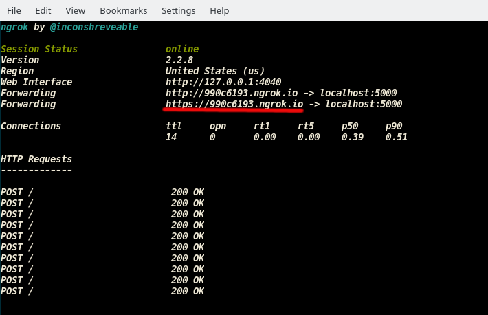

# Why?
This repo is based on Udacity's [AIND-VUI-Alexa Project](https://github.com/udacity/AIND-VUI-Alexa). I've rewritten the Alexa node.js app using python and [Flask-ask](https://github.com/johnwheeler/flask-ask). I enjoy building alexa skills with Flask-ask so I wanted to share.

# Project: Build an Alexa History Skill In Python

It's time to create your own Alexa Skill!.  In this project, you’ll build a fully functional skill for [Amazon’s Alexa](https://developer.amazon.com/alexa) that provides year-dated facts from AI History (or some other History of your choosing).


# Getting Started

### Set up your Amazon accounts

We highly recommend you complete the Space Geek lab in the classroom, which steps you through setting up your [Amazon Developer ](https://developer.amazon.com/alexa-skills-kit) and [Amazon AWS](https://aws.amazon.com/) accounts as well as building the project this one is based on.

### Starter Code
Install your starter code locally.
* Download or clone the [starter code](https://github.com/JacobPolloreno/AIND-VUI-Alexa) from GitHub
* Save it in a directory named `AIND-VUI-Alexa`.  It contains the following directories and files:
    - **speechAssets/IntentSchema.json**  - intents definition for the interactive model
    - **speechAssets/SampleUtterances_en_US.txt** - utterances for the interactive model
    - **src/index.py** - skill logic and handlers to be run in AWS Lamda
    - **src/templates.yaml** - a template file that loads phrases to be used in your skill responses
    - **src/app.py** - helper file for AWS Lambda deployment; don't need to modify
    - **src/tests/*.py** - various unit tests to be run locally with pytest
 
 
### Environment

#### Flask-Ask Skills to AWS Lambda with Zappa
Check out [flask-ask tutorial](https://developer.amazon.com/blogs/post/8e8ad73a-99e9-4c0f-a7b3-60f92287b0bf/new-alexa-tutorial-deploy-flask-ask-skills-to-aws-lambda-with-zappa) blog post for a full step-by-step walk through that goes from creating a virtual env to deployment.

##### 1. Create virtual environment
* Navigate to the `AIND-VUI-Alexa` directory of the starter code and open a terminal window. Next, create a python virtual environment.

```shell
$ pip install virtualenv
$ virtualenv venv
```

* A directory named _venv_ now exists inside `AIND-VUI-Alexa` directory. The virtual environment will help Zappa identify necessary dependencies that need to be deployed with your code. Next, we need to activate it. 

```shell
$ source venv/bin/activate (Unix)

$ venv\Scripts\activate (Windows)
```

##### 2. Install dependencies for the project

* The dependencies we need are listed in the `requirements.txt` file and include the [Flask-ask](https://github.com/johnwheeler/flask-ask) library for Alexa as well as  [pytest](https://docs.pytest.org/en/latest/) test framework for python along with [Zappa](https://github.com/Miserlou/Zappa) for deploying to AWS lambda and [aws-cli](https://github.com/aws/aws-cli) to generate AWS config files. Install them all in your virtual env with the following command:

```shell
$ pip install -r requirements.txt
```

##### 3. Unit testing
* You can now run the provided unit tests from the command line within the `AIND-VUI-Alexa` directory with the following command.  Try it now:
```shell
$ pytest -rsx
```

The test code is in four parts:  "Part 1", "Part 2", "Part 3", and "Starter Code". The starter code tests should pass and all others should fail.

* **Note:** Some test are __skipped__ because you haven't implemented everything yet to run it.
	- Why skip? The output gets really long and makes it hard to debug with the 'NotImplementedErrors' so I decided to skip the test and warn the user. However, in order to see that the test are skipped you'll need to run 'pytest' with flags _' -rsx'_

You can run each individual part like so:

```shell
$ pytest -rsx src/tests/test_starter_code.py
```

##### 4. Flask-ask Coding
* Make sure to checkout the documentation on the [Flask-ask Github Repo](https://github.com/johnwheeler/flask-ask). 
	- **Note:** The flask-ask repo contains various examples, including the [Space Geek](https://github.com/johnwheeler/flask-ask/tree/master/samples/spacegeek) project in the [Samples Directory](https://github.com/johnwheeler/flask-ask/tree/master/samples).
* This repo also includes my sample solutions to each part in separate branches. To see sample solutions to part 1 switch to the branch:
```shell
$ git checkout solution_part_1
```

##### 5. Run the code locally
* While developing you can run the code locally and test using [Echosim.io](https://echosim.io/welcome) and [Ngrok](https://ngrok.com/) without deploying. After you've created the skill in the Amazon console and install Ngrok.
	```
	$ npm install -g ngrok
	```
* You can try with the starter code.
	1. Navigate to the `AIND-VUI-Alexa` directory, open a terminal, and run the app.
	
			$ python index.py
				* Running on http://127.0.0.1:5000/
		
	2. Then, open a second terminal, run the command below, and copy the 'HTTPS' link.
	

			$ ngrok http 5000

		

	3. In the Amazon developer console > 'Configuration' tab, under 'Endpoint' select 'HTTPS', select a graphical region, and paste the URL. Click 'Save' and test it out.

##### 6. Run the Starter Code on AWS Lambda
* Go through the full tutorial deployment steps to [here](https://developer.amazon.com/blogs/post/8e8ad73a-99e9-4c0f-a7b3-60f92287b0bf/new-alexa-tutorial-deploy-flask-ask-skills-to-aws-lambda-with-zappa)
* **FOR SUCCESSFUL DEPLOYMENT:** When setting up the zappa config file with the following command: 
```shell
$ zappa init
```
It'll ask you where your app function is located. Make sure that you point it to **'src.app.app'** and NOT 'src.index.create_app' or 'src.index.app'. You can also change this in the generated 'zappa_settings.json' file as well. (Why? There's an issue with AWS Lambda and Flask blueprints)

* You can deploy the starter code to verify that it works.


# Instructions

The starter code provides a simple fact skill similar to Space Geek, except a few AI history facts have been provided in an external file, `templates.yaml`, instead of the space facts.  Each fact includes a 4-digit year in its text, which we will use in the project for a new feature.

The project consists of three parts:
1. Customize the fact skill
2. Add a feature using an additional intent and a slot
3. Add conversational elements

Follow the instructions in 'index.py' file and run the unit test after each part is complete.

**Can't be submitted to Udacity. This project is just for educational purposes**
